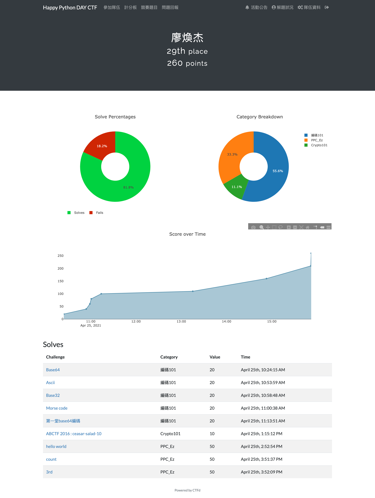

# 20210425 Happy Python Day
## 當日解題結果

### 解題報告
#### 編碼 101
- [Base64](/20200425%20Happy%20Python%20Day/編碼101/Base64.py) 
- [Acsii](/20200425%20Happy%20Python%20Day/編碼101/Acsii.py)
- [Base32](/20200425%20Happy%20Python%20Day/編碼101/Base32.py)
- Morse Code
    - 將下列秘文貼進[這個網頁](https://morsecode.world/international/translator.html)就有解答
  - `.. -. ..-. --- ... . -.-. ..-. .-.. .- --. .. ... -- --- .-. ... .. -. --.` 
- [第一堂 base64 編碼](/20200425%20Happy%20Python%20Day/編碼101/第一堂%20base64%20編碼.py)
#### PPC_Ez
- [helloworld](/20200425%20Happy%20Python%20Day/PPC_Ez/helloworld.py)
- [count](/20200425%20Happy%20Python%20Day/PPC_Ez/count.py)
- [3rd](/20200425%20Happy%20Python%20Day/PPC_Ez/3rds.py)
